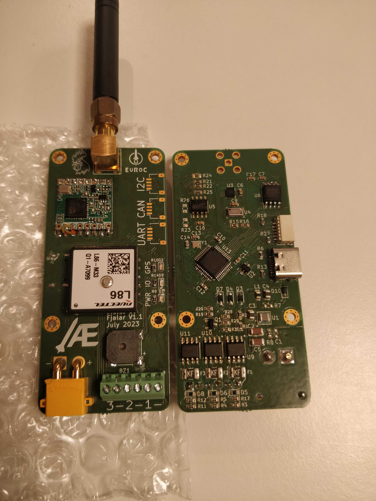

# Fjalar flight controller
Fjalar is a rooster in Jotunheim who heralds the advent of ragnarök, or in our case, apogee.

### features
1. 3 pyro channels
1. barometer
1. IMU
1. GPS
1. USB-C
1. flash memory
1. CAN, I2C, UART connectors
1. LoRa radio
1. continuity detection

### schematic
see [here](./design/euroc_controller.pdf)

### hardware
hopefully soon :)
